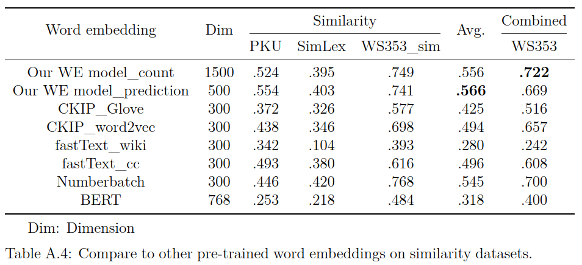

  

Table 4.9 shows comparison of our word embeddings and other pre-trained ones in relatedness tasks.  
Our count-based model outperforms other models in the similarity/relatedness tasks,  
and our prediction-based model and Numberbatch are the second.  
Even if the same dimensions (300d), our model still outperforms other pre-trained ones.

  

Table A.4 shows the comparison in similarity tasks.  
Our predition model has the highest spearman scores.
