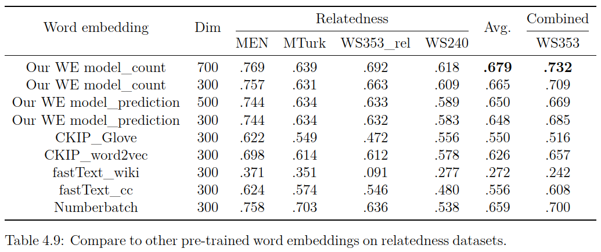

## Corpora
Corpora    | #Words      | Vocabulary size | Capacity
:---------:|:-----------:|:---------------:|:--------:
PTT, WIKI  | 858,118,783 | 249,571         | 5.38 GB

- #Words: The number of segmented words.
- Vocabulary size: the word frequency is greater than 29 (to reduce unreasonable and rare words).

## Compare to other pre-trained word embeddings

  

Table 4.9 shows comparison of our word embeddings and other pre-trained ones in relatedness tasks.  
Our count-based model outperforms other models in the similarity/relatedness tasks,  
and our prediction-based model and Numberbatch are the second.  
Even if the same dimensions (300d), our model still outperforms other pre-trained ones.  
--------------

  

Table A.4 shows the comparison in similarity tasks. Our prediction model has the highest spearman score.
