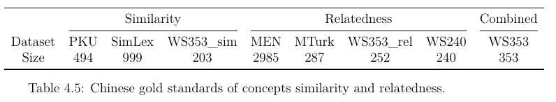

  

# References
## Relatedness
Bruni_Men_3000
> E. Bruni, N.K. Tran, M. Baroni. (2012) "Multimodal Distributional Semantics". Journal of Artificial Intelligence Research 49:1-47

Radinsky_mturk
> K. Radinsky, E. Agichtein, E. Gabrilovich, S. Markovitch. (2011) "A Word at a Time: Computing Word Relatedness using Temporal Semantic Analysis". Proceedings of the 20th International Conference on World Wide Web, WWW 2011. 337-346

Wordsim_353_relatedness
> E. Agirre, E. Alfonseca, K. Hall, J. Kravalova, M. Pasca and A. Soroa. (2009) "A Study on Similarity and Relatedness Using Distributional and WordNet-based Approaches". Proceedings of NAACL-HLT 2009. 19-27

Wordsim_240
> P. Jin and Y. Wu. (2012) "SemEval-2012 Task 4: Evaluating Chinese Word Similarity". Association for Computational Linguistics. 374-377

## Similarity
PKU_500
> Y. Wu and W. Li. (2016) "Overview of the NLPCC-ICCPOL 2016 Shared Task: Chinese Word Similarity Measurement". In Proceedings of NLPCC 2016. 828-839

SimLex_999
> F. Hill, R. Reichart, A. Korhonen. (2015) "Simlex-999: Evaluating semantic models with (genuine) similarity estimation". Computational Linguistics 41(4):665-695 

Wordsim_353_similarity
> E. Agirre, E. Alfonseca, K. Hall, J. Kravalova, M. Pasca and A. Soroa. (2009) "A Study on Similarity and Relatedness Using Distributional and WordNet-based Approaches". Proceedings of NAACL-HLT 2009. 19-27

## Combined
Wordsim_353 (combination of WS-353_sim and WS-353_rel)
> L. Finkelstein, E. Gabrilovich, Y. Matias, E. Rivlin, Z. Solan, G. Wolfman, and E. Ruppin. (2002). "Placing Search in Context: The Concept Revisited". ACM Transactions on Information Systems, 20(1):116-131

## Chinese version
Bruni_Men_3000  
Radinsky_mturk  
Wordsim_353_relatedness  
SimLex_999  
Wordsim_353_similarity  
> Chi-Yen Chen, Wei-Yun Ma. (2018) "Word Embedding Evaluation Datasets and Wikipedia Title Embedding for Chinese". Language Resources and Evaluation Conference.
